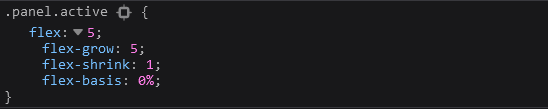

# 学习到的技术
## CSS
### Flex
我们发现在这个项目中，很多时候使用到了flex:1,flex:10的概念，所以有必要在这对flex技术进行解释。
**flex后接一个数字，这个数字的值代表flex-grow的值**

这里解释一下flex-grow,flex-shrink和flex-basis的含义
|  名称 | 含义  |
| ---- | ---- |
| flex-grow |  flex-grow 定义项目的放大比例，默认为0，即如果存在剩余空间，也不放大 |
| flex-shrink |flex-shrink 定义了项目的缩小比例，默认为1，即如果空间不足，该项目将缩小 |
| flex-basis | flex-basis 给上面两个属性分配多余空间之前, 计算项目是否有多余空间, 默认值为 auto, 即项目本身的大小 |

这里的flex-grow为10的意思就是选中的图片是其他的未选中图片大小的10倍。

### CSS3的过渡动画
